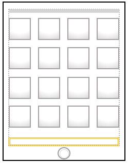
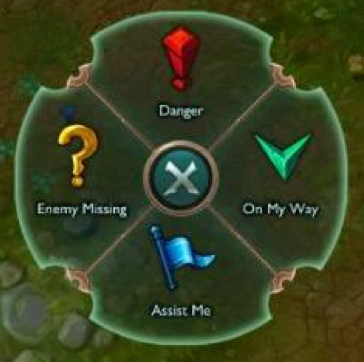
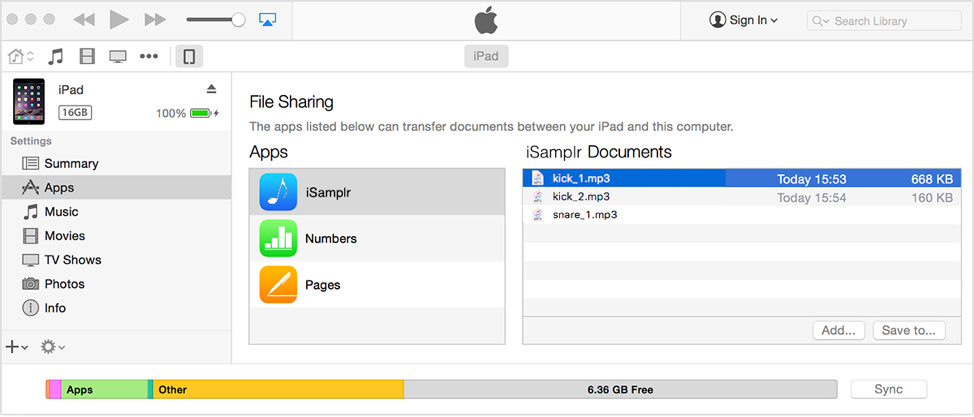

# iSamplr 

A soundboard app for iOS (iPad). _shh, it's a working title._

## Overview
iSamplr (working title) is an iPad app that allows the user to load a sound file, or record a sound clip using internal microphone of iPad (or headphones with microphones designed to work with iOS devices). The main goal of the app is to allow entry- to amateur-level DJs to produce music using the sampled sounds that are bound to each button. An example of its advanced usage is [Girl Talk](https://www.youtube.com/watch?v=glbgOGRdWB0), and [the Glitch Mob](https://www.youtube.com/watch?v=WImWuxHbQCw). There are numerous sampler soundboard apps that are already out in the App Store, but iSamplr is distinguished for its ability to record using the microphone or upload sound files from user’s computer via iTunes sync. iSamplr will be distributed as a shareware, where a limited amount of functionality is provided, with a minimal amount of iAd displayed at the bottom of the view. 

## Technical stuff
iSamplr will be built targeting recent generations of iPad (iPad Air, iPad 4th Generation, iPad Mini 2) with iOS version 9 and up. The most recent version of iOS would be optimal.

## Design

The basic UI will look like below:

There are 16 buttons, with only first two rows enabled as shareware. An iAd is also displayed at the bottom, indicated with an orange box.

For each button, a sound file is bound; it can be either recorded (as a voice recording clip file) or loaded. When a button is tapped, it will play a sound that is bound to this button. Initially, it is bound to nothing, and will do nothing if tapped. When a user taps and holds a button for long enough (≥ 1 second), a pop-up menu will appear that resembles the “smart ping menu” introduced in League of Legends like below:


(During the game, when a user holds Alt key and right clicks in the screen, a quick pop up menu for signaling situations to communicate with the team)

The user will be prompted to do one of the followings in the “smart menu”: record new sample, load from existing samples, change default color, change tapping (“highlight”) color. These will allow the user to fully utilize visual effects of the app.

For existing samples, the user will be allowed to load sample files into the app using iTunes. The iTunes-iOS File Sharing will be used. The below picture is a graphical mockup of what it will look like: 


User will be able to put in his/her own sampled sound files, as well as extract a sample clip from iPad to his/her computer. 

## Implementation
Follow the MVC pattern:

- Model: `ButtonModel`
	- set up `playerButton` at `viewDidLoad`
- View:
	- main storyboard
		- 16 buttons view (4x4 form)
	- button options
		- sample list
		- record view
		- change button image view
- Controller: `ViewController`
	- tapping a button:
		- changes to tapping image and back to normal image
		- plays the sound
	- holding a button:
		- record new -> model
		- load file -> model
		- change default image -> model
		- change tapping image -> model